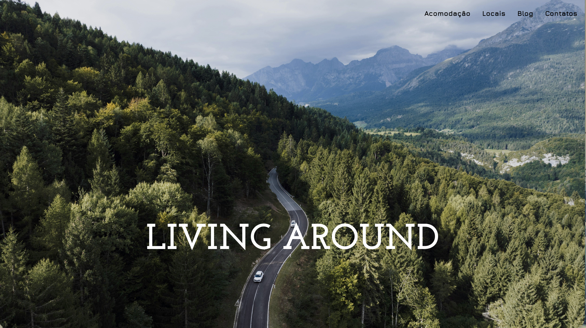

# 🌍 Living Around

[](https://catirato.github.io/Living_around/)


Experiência web multipágina inspirada no lifestyle de **digital nomads**, pensada para cruzar **trabalho remoto, viagem, liberdade de movimento e descoberta de destinos** através de uma identidade visual ligada ao universo **van life** 🚐🌍

🔗 **Live demo:**
https://catirato.github.io/Living_around/

---

# 🖼️ Preview



---

# 📖 Sobre o projeto

O **Living Around** foi desenvolvido no contexto do módulo de **Programação Web** do **CESAE Digital**, em **2025**.

A proposta foi criar uma aplicação **front-end estática** com identidade própria, forte componente visual e navegação simples entre diferentes áreas da experiência.

Mais do que uma landing page, este projeto apresenta um pequeno **ecossistema de páginas ligadas entre si**:

* homepage
* alojamento
* locais
* contacto
* detalhe de produto

O objetivo foi construir uma interface coerente, com **storytelling visual, hierarquia clara e pequenas interações em JavaScript** para tornar a navegação mais dinâmica.

---

# ✨ Funcionalidades

* 🏠 Homepage com **hero section**, navegação principal e chamadas para ação
* 🚐 Página de **acomodação** com cards de carrinhas, preços e características
* 📦 Página de **detalhe em formato modal** para uma opção de alojamento
* 🌍 Página de **locais** com seleção de país e cidade
* 🔀 **Redirecionamento automático** para uma página de destino específica
* 📍 Página dedicada ao **Porto** com mapa incorporado e contactos locais
* 📩 Página de **contactos com formulário** e feedback visual de envio
* 📱 **Menu mobile responsivo** com `<details>` e `<summary>`

---

# 🧰 Stack utilizada

| Tecnologia        | Utilização                 |
| ----------------- | -------------------------- |
| **HTML5**         | Estrutura das páginas      |
| **CSS3**          | Estilo visual              |
| **Bootstrap 5.3** | Grelha e componentes       |
| **JavaScript**    | Interações e comportamento |
| **Google Fonts**  | Tipografia                 |

---

# 🎨 Direção visual

O projeto foi pensado com uma abordagem mais **editorial e atmosférica** do que funcional no sentido clássico de produto.

Elementos principais da identidade visual:

* 📷 **Imagens de grande escala** para reforçar contexto e emoção
* 🔤 Combinação tipográfica entre **serif e sans-serif geométrica**
* 🧱 **Blocos visuais amplos** com contraste forte
* 🧭 Navegação direta entre secções principais
* 🌲 Estética associada a **liberdade, estrada, natureza e trabalho remoto**

---

# ⚙️ Destaques técnicos

* 🎨 Estilo centralizado num único ficheiro
  `style_index.css`

* 📄 Layout **multipágina com consistência visual**

* 🧱 Uso de **Bootstrap** para grelha e utilitários

* ⚡ Interações simples em **JavaScript**

  * redirecionamento automático
  * confirmação de formulário

* 🌐 Estrutura **estática pronta para GitHub Pages**

---

# 📂 Estrutura do projeto

```text
Living_around/
├── index.html
├── Page_Acomodação.html
├── Page_Locais.html
├── Page_Locais_Porto.html
├── Page_Contatos.html
├── Page_Contatos_Alert.html
├── Modal.html
├── style_index.css
└── Imagens/
```

---

# 🚀 Como correr localmente

Por ser um projeto **estático**, não existe build step.

### 1️⃣ Clonar o repositório

```bash
git clone https://github.com/catirato/Living_around.git
```

### 2️⃣ Abrir o projeto

Abrir o ficheiro:

```
index.html
```

no browser.

### Opcional

Usar um servidor local como:

* **Live Server** (VS Code)
* **Python Simple Server**

---

# 📚 Aprendizagens

Durante este projeto foram trabalhados vários conceitos de **desenvolvimento front-end**:

* Estruturação de um **projeto multipágina**
* Construção de **layouts responsivos**
* Organização de **estilos centralizados**
* Aplicação de **interações em JavaScript**
* Desenvolvimento de uma **identidade visual coerente**

---

# 🔮 Próximos passos possíveis

* Substituir **links placeholder** por conteúdo real
* Melhorar **semântica e acessibilidade da interface**
* Adicionar **validação mais robusta** ao formulário
* Criar mais páginas de **detalhe para destinos e acomodações**
* Otimizar **imagens e performance geral**
* Evoluir o projeto para uma versão com **componentes reutilizáveis**

---

# 👩‍💻 Autora

**Catarina Rato**

Projeto desenvolvido no módulo de **Programação Web** do **CESAE Digital**.
